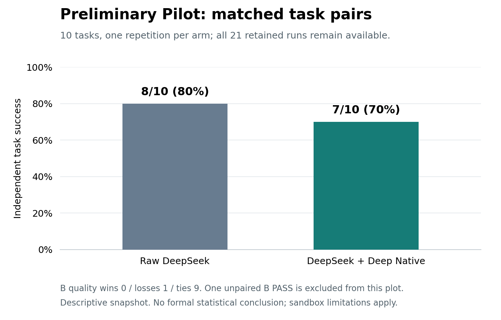

# Deep Native

**Evidence-first coding for DeepSeek in Claude Code.**

[中文说明](README.zh-CN.md) · [中文完整教程](docs/tutorial.zh-CN.md) · [Executed demo](docs/demo/demo.html) · [Test report](docs/validation.md) · [Evaluation protocol](evals/README.md)

> **No evidence, no done.**
> A small Skill plus local verification tools. Not a model upgrade, not a Claude clone,
> and not a claim that DeepSeek now matches Claude.

```text
Inspect -> Reproduce -> Edit -> Verify -> Review -> Deliver
                              |
                   current code + required checks
                              |
                   evidence receipt, not a promise
```

## What ships in v0.1.0

| Component | What it actually does |
| --- | --- |
| `SKILL.md` | A bounded, adaptive coding workflow: investigate first, verify before done, report blockers honestly |
| `doctor` | Read-only configuration presence checks; no API request or secret output |
| `install` | Project-scoped Skill installation; no global settings or model changes |
| Check contract | Named required commands, frozen when a task begins |
| `verify` / `finish` | Actual subprocess checks, exit codes, timeouts, worktree fingerprints, stale-result rejection |
| Checkpoint / recovery | Small persisted progress notes; optional matching-session recovery hook |
| Optional Stop hook | One continuation reminder, then explicit unverified escape to avoid loops |
| Demo / grader | A real offline scripted replay and equal fixtures for future model comparisons |

The helper uses Python's standard library. Runtime support: **Python 3.10+ on macOS/Linux**,
Git, and a trusted repository. Windows runtime support is not claimed; use WSL.
The Skill itself has no package dependency, but the evidence helper requires Python.

## Try the offline demo first

No Claude installation, API key or model bill required:

```bash
git clone https://github.com/Anhao1314/deep-native.git
cd deep-native
python3 -m unittest discover -s tests -v
python3 examples/demo.py --output artifacts/demo
```

Open `artifacts/demo/demo.html` locally. On macOS:

```bash
open artifacts/demo/demo.html
```

The demo executes failing tests, rejects premature completion, applies an explicitly
**scripted** repair, restores a checkpoint, verifies, rejects evidence after a later
edit, and verifies again. Twelve recorded steps, not an animation pretending to be an
agent. The checked-in [JSON transcript](docs/demo/demo.json) is inspectable.

## Install into an existing Claude Code project

Already running Claude Code through DeepSeek? **Keep your working provider setup.**
This project does not need your API key and does not change model settings.

```bash
# From this cloned deep-native directory:
PROJECT="/absolute/path/to/your/git-project"
python3 deep_native.py --project "$PROJECT" doctor
python3 deep_native.py --project "$PROJECT" install
```

Restart Claude Code in that project and invoke:

```text
/deep-native Fix the retry behavior. Inspect first, add a regression test,
verify the actual change, and report any untested limitations.
```

For optional session recovery and a bounded Stop reminder:

```bash
python3 deep_native.py --project "$PROJECT" install --hooks
```

This merges only our entries into `.claude/settings.local.json`, preserves unrelated
settings, and grants no tools or permission bypass. Inspect the file before restarting.
Different existing Skill files are never overwritten. See [installation and removal](docs/tutorial.zh-CN.md).

## Manual evidence workflow

Configure the **real test command for your project**, not a command that simply exits zero.
This example uses a Python unittest project:

```bash
DN="$PWD/deep_native.py"
python3 "$DN" --project "$PROJECT" configure --name tests -- python3 -m unittest discover -s tests
python3 "$DN" --project "$PROJECT" begin --goal "Fix retry semantics without regressions"
# Make and inspect the actual change.
python3 "$DN" --project "$PROJECT" checkpoint --note "Located and fixed boundary condition" --next "Run regression suite"
python3 "$DN" --project "$PROJECT" verify --timeout 60
python3 "$DN" --project "$PROJECT" finish --summary "Retry semantics fixed" --risk "Provider integration not tested"
```

`--project` goes **before** the subcommand. `configure` accepts argv after `--`, not a
shell string. Add multiple named checks before `begin`; every configured check is
required. For hook activation the Skill supplies Claude Code's current session ID.
The manual CLI session defaults to `manual` and does not attach to an arbitrary session.

Exit codes: **0** successful command, **1** verification failed, **2** invalid input,
blocked completion or runtime error. Hook errors are reported as warnings with exit 0
so a broken hook cannot trap the user; they never certify success.

## Preliminary local A/B pilot — paused at 21 runs

**STOP: stop expanding this campaign.** The planned 60-run experiment was
paused at the user's request. All 21 completed runs are retained:
A has 10 and B has 11; the matched comparison uses 10 pairs.
The extra B run, T08 repeat 2, passed and remains visible separately.



| Observed metric | Raw DeepSeek | DeepSeek + Deep Native |
| --- | ---: | ---: |
| Strict success, matched 20 runs | 8/10 (80.0%) | 7/10 (70.0%) |
| Strict success, all retained runs | 8/10 (80.0%) | 8/11 (72.7%) |
| Verified completion / explicit DONE | 5/5 | 1/1 |
| Unknown completion declaration | 5/10 | 10/11 |
| Median agent seconds, all runs | 108.0 | 103.7 |
| Median available total tokens, including cache | 465,399 (9/10 available) | 482,782 (9/11 available) |
| Median tool calls | 29.0 | 36.0 |
| Actual API dollar cost | unavailable | unavailable |

Across common pairs, median B/A ratios are 1.20 for agent time (10 pairs) and
1.21 for context-processing tokens (8 pairs). B had 0 quality wins,
1 loss (T08), and 9 ties. False completion was not observed under the fixed
final-marker rule; the small DONE denominators and many unknown declarations
prevent a claim that Deep Native reduces it.

This is a descriptive preliminary snapshot. The formal frozen judgment remains
INCONCLUSIVE because 60 runs were not completed. The independent grades and artifact
hashes passed audit, while trace review found 17 sandbox-related shell temporary
file denials and overly broad automatic verification proxies. These limit causal
interpretation; no Skill tuning or additional API runs followed the pause.

Claude Code 2.1.289; requested model `deepseek-flash[1m]`, official response model
`deepseek-flash`; Deep Native fixed at
`fda3dd010e7de8f8c1ee1953e006e577464aa3d6`.

[Stage report](evals/benchmark-v1/reviews/preliminary-v4.md) · [Chinese report](evals/benchmark-v1/reviews/preliminary-v4.zh-CN.md) ·
[Machine-readable stage results](evals/benchmark-v1/reviews/preliminary-v4.json) · [Methodology](evals/benchmark-v1/README.md) ·
[Raw artifacts](evals/benchmark-v1/results/2026-10-06-pilot-v4/runs/)

## What has and has not been measured

| Experiment | Status |
| --- | --- |
| Runtime, installer, failure-path and fixture-grader tests | See [actual validation report](docs/validation.md) |
| Offline scripted repair and stale-evidence demo | Executed; [12-step transcript](docs/demo/demo.json) |
| Three-arm fixture identity / external grader | Tested locally |
| Actual Claude Code Skill loading and hook lifecycle | Live local traces in the preliminary pilot above |
| DeepSeek raw vs DeepSeek + Skill | Preliminary local A/B above; native Claude comparison not run |
| Model accuracy, token savings, cost savings, native parity | **No claim** |

The original v0.1 authoring environment had no Claude executable, model credentials
or external DNS access. The subsequent preliminary pilot above records live calls.
Unit tests and hook payload simulations alone are **not** live host validation.
The [evaluation protocol](evals/README.md) explains how to run the missing comparisons
without passing off fixture tests as model performance.

## Limits that matter

Verification covers Git-tracked and nonignored untracked worktree bytes, the check
contract, symlink targets and executable bits. It excludes local state and untracked
ignored files. External services, dependencies and environment changes are not covered.
Submodules and oversized worktrees fail explicitly. See [coverage details](skills/deep-native/references/verification.md).

Checks run real programs. This is **not a sandbox**. Do not run untrusted repositories
or model patches without OS/container isolation. The wrapper does not forward model
credentials to checks and does not store test stdout/stderr, but programs can still
read files or contact networks. Local receipts are not signed or tamper-proof; an agent
with filesystem access can forge them. Use independent CI and code review for trust.

A Skill cannot supply unsupported API capabilities, larger model intelligence or
perfect instruction following. Extra planning/checks can increase latency and token
usage. Tiny read-only tasks should not pay for a full task lifecycle.

## Project layout

```text
skills/deep-native/      Installable Skill, references and standalone helper
deep_native.py          Zero-install CLI entry point
tests/                  Offline regression and negative tests
examples/demo.py        Executed fixture -> HTML and JSON replay
evals/                  Equal workspaces and external patch grader
docs/                   Tutorial, validation, architecture, sources and replay
.github/workflows/      CI definition; workflow status is separate from local results
```

## Contributing

Start with a reproducible failure and a failing test. Keep the Skill small and preserve
existing permissions. Do not submit credentials, conversation transcripts or fabricated
benchmark results. See [CONTRIBUTING.md](CONTRIBUTING.md) and [SECURITY.md](SECURITY.md).

Licensed under MIT. Independent project; not affiliated with or endorsed by Anthropic
or DeepSeek. The aspiration is native-like workflow reliability; any improvement must
be demonstrated on held-out tasks, not inferred from the project name.
